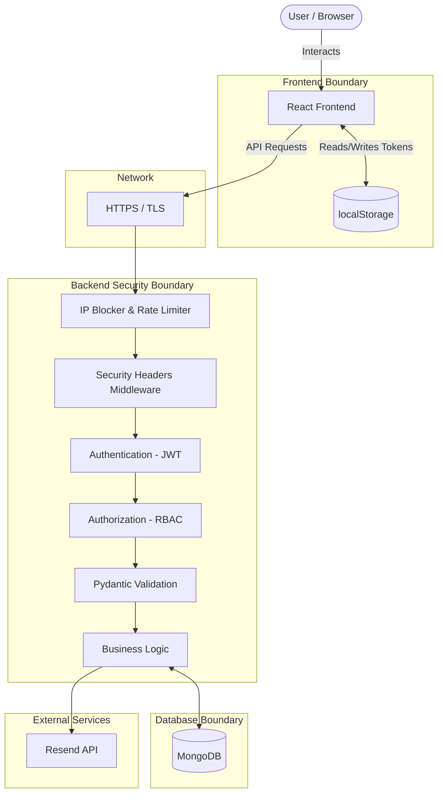

# Raashi Web Application Security Assessment & Documentation

## 1. Security Executive Summary

The Raashi Web Application demonstrates a **high level of security maturity** for a modern web application, particularly on the backend. The FastAPI backend employs strict rate limiting, automated IP blocking, robust JWT lifecycle management (with refresh token rotation and revocation), explicit role-based access control, and strict startup configuration validation. 

**Major Security Mechanisms Implemented:**
* Strong password hashing (Bcrypt).
* Layered abuse protection (SlowAPI rate limits + custom IP-blocking middleware + Security Audit Middleware).
* Strict input validation using Pydantic schemas.
* File upload protection (magic bytes validation, size limits, filename sanitization).
* Secure password reset and email verification workflows with anti-enumeration protections.
* Comprehensive HTTP security headers (CSP, HSTS, etc.).

**Major Risks Discovered:**
* **Token Storage (High):** JWT access and refresh tokens are stored in the frontend's `localStorage`. This exposes the application to severe session hijacking risks if a Cross-Site Scripting (XSS) vulnerability occurs.

**Overall Security Maturity:**
**8.5 / 10** 
The backend is extremely well-hardened and correctly implements defense-in-depth principles. The primary gap preventing a higher score is the reliance on `localStorage` rather than `HttpOnly` cookies for token storage.

---

## 2. Application Security Architecture

The application follows a decoupled client-server architecture where the React frontend communicates with the FastAPI backend over a REST API.

**Boundaries:**
* **Public Boundary:** Unauthenticated access is allowed to read CMS content, submit contact forms, and apply for jobs/internships (subject to rate limits and IP blocking).
* **Protected Boundary:** All state-changing operations and sensitive data reads require a valid JWT Access Token.
* **Database Boundary:** Motor (MongoDB) is used exclusively via repository abstractions.

---

## 3. Authentication Security

The authentication system is well-designed and implements numerous best practices.

* **Login Flow:** ✅ Secure. Checks lockout status, verifies bcrypt hash, clears failed attempts, and returns a short-lived access token and long-lived refresh token.
* **Password Storage:** ✅ Secure. Uses `bcrypt` with salt and a reasonable work factor.
* **Session/Token Mechanism:** ⚠️ Partially Implemented. Uses JWT. The backend properly implements token revocation (`is_token_revoked`), but the frontend stores tokens in `localStorage`.
* **Refresh Mechanism:** ✅ Secure. Refresh tokens are rotated upon use, and the old token is placed on a revocation list to prevent reuse.
* **Password Reset & Verification:** ✅ Secure. Uses purpose-specific JWTs with short expiries. Responses are generic to prevent email enumeration.
* **Login Attempt Protection (Lockout):** ✅ Secure. Tracks failed logins in MongoDB with a TTL index and locks accounts after `MAX_FAILED_LOGIN_ATTEMPTS` (5 attempts / 15 mins).

---

## 4. Authorization and Role-Based Access Control

Authorization is correctly enforced on the backend, ensuring the frontend cannot bypass permissions.

* **Implemented Roles:** `admin`, `coordinator`.
* **Enforcement:** Enforced via `Depends(require_role("admin"))` and `require_permission()` decorators on the API routes. 
* **Scope Isolation:** Evaluated endpoints in `admin.py` confirm that coordinators cannot access administrative endpoints (e.g., creating other coordinators, viewing global audit logs, managing website content).
* **Missing Frontend Enforcement Risks:** ❌ None. While the frontend uses React Router to hide pages, the backend explicitly verifies the JWT role on every protected request.

**Test Scenarios Evaluated:**
* Normal user → Admin endpoint: ✅ Backend rejects with HTTP 403.
* Coordinator → Admin-only operation: ✅ Backend rejects with HTTP 403.
* Unauthenticated user → Protected endpoint: ✅ Backend rejects with HTTP 401.

---

## 5. API Security Audit

The backend API is extensively protected against abuse.

| Endpoint | Method | Authentication | Required Role | Input Validation | Rate Limiting | Security Status |
| -------- | ------ | -------------- | ------------- | ---------------- | ------------- | ------------- |
| `/api/v1/auth/login` | POST | None | None | Pydantic | `RATE_LIMIT_LOGIN` | ✅ Secure (Anti-enumeration) |
| `/api/v1/auth/refresh` | POST | None (Refresh JWT) | None | Pydantic | `RATE_LIMIT_LOGIN` | ✅ Secure (Rotation enforced) |
| `/api/v1/admin/*` | ALL | Access JWT | Admin | Pydantic | `RATE_LIMIT_ADMIN` | ✅ Secure |
| `/api/v1/careers/apply` | POST | None | None | Pydantic / File Checks | `RATE_LIMIT_APPLY` | ✅ Secure |
| `/api/v1/internships/apply`| POST | None | None | Pydantic / File Checks | `RATE_LIMIT_APPLY` | ✅ Secure |

**Noteworthy Implementations:**
* **Pagination Caps:** Uses a `cap_pagination` validator to prevent large `limit` values that could cause resource exhaustion.
* **Mass Assignment:** Mitigated by strict Pydantic schemas (`exclude_none=True` on updates).

---

## 6. Database Security

MongoDB is accessed via the `motor` asynchronous driver.

* **Injection Risks:** ✅ Secure. PyMongo/Motor uses BSON document queries rather than string concatenation, inherently protecting against traditional SQL/NoSQL injection.
* **Data Abstraction:** ✅ Secure. All database interactions occur within repository classes (e.g., `JobOpeningRepository`), standardizing queries and preventing accidental raw data exposure.
* **Data Expiration:** ✅ Secure. Uses MongoDB TTL indexes on `revoked_tokens` and `login_attempts` to automatically purge stale security data.

---

## 7. Password Security

* **Hashing Algorithm:** ✅ Secure. `bcrypt.hashpw()` is used. 
* **Password Validation:** ✅ Secure. Uses a custom `validate_password_complexity` validator before accepting new passwords.
* **Data Exposure:** ✅ Secure. API responses map MongoDB objects to Pydantic schemas (e.g., `UserOut`), which explicitly exclude the `password_hash` field.

---

## 8. Session and Token Security

* **Token Format:** ✅ Secure. Standard JWT with strict payload validation.
* **Token Expiration:** ✅ Secure. Access tokens default to 60 minutes.
* **Token Storage:** ❌ **Missing/Insecure**. The React frontend currently uses `localStorage.setItem("auth_token", ...)` in `api.ts` and `AuthContext.tsx`. This exposes tokens to XSS attacks.
* **Token Revocation:** ✅ Secure. Explicit logout adds the JWT ID (`jti`) to a MongoDB blacklist.

---

## 9. Email Verification and Password Reset Security

* **Token Generation:** ✅ Secure. JWTs are generated with specific `"purpose"` claims. 
* **User Enumeration:** ✅ Secure. `/forgot-password` and `/resend-verification` unconditionally return HTTP 200 with generic messaging ("If this email is registered...").
* **Expiration:** ✅ Secure. Password reset tokens expire in 15 minutes.

---

## 10. Rate Limiting and Abuse Protection

Rate limiting and abuse protection is **exceptionally strong**.

* **SlowAPI:** Distinct rate limits are applied per route (`RATE_LIMIT_LOGIN`, `RATE_LIMIT_APPLY`, etc.).
* **Security Audit Middleware:** Tracks request volumes in 60-second sliding windows. Triggers alerts at `_ALERT_THRESHOLD` (200 req/min).
* **IP Auto-Blocker:** `IPBlockMiddleware` automatically bans IP addresses that repeatedly violate rate limits (`IP_BLOCK_VIOLATION_THRESHOLD` = 10 violations).
* **Bot Detection:** `BotDetectionMiddleware` is enabled in configuration.

---

## 11. Input Validation

* **Backend Validation:** ✅ Secure. All route parameters and request bodies are strictly typed using Pydantic schemas. 
* **Unexpected Input Handling:** ✅ Secure. FastAPI automatically drops unmapped JSON fields and returns HTTP 422 Unprocessable Entity for invalid types.

---

## 12. Injection Security

* **NoSQL Injection:** Mitigated by Motor abstractions.
* **Command Injection:** Not applicable; no OS commands are executed.
* **Header Injection:** Not identified.

---

## 13. Cross-Site Scripting (XSS)

* **Backend Protection:** ✅ Secure. The `bleach` library is included in requirements, likely used for sanitizing HTML in CMS content.
* **Frontend Protection:** ✅ Secure. React automatically escapes variables in JSX.
* **Risk Context:** Because tokens are in `localStorage`, *any* XSS vulnerability discovered in the future would result in full account compromise.

---

## 14. CSRF Security

* **Status:** Not applicable by design.
* **Reasoning:** The application relies on `Authorization: Bearer <token>` headers instead of cookies. Because the browser does not automatically attach the token to cross-origin requests, CSRF is inherently mitigated.

---

## 15. CORS Security

* **Configuration:** Managed via `config.py`. 
* **Production Safety:** ✅ Secure. The startup script (`validate_settings`) explicitly crashes the application in production if `CORS_ORIGINS` contains a wildcard (`*`).

---

## 16. Security Headers

* **Implementation:** ✅ Secure. Handled by `SecurityHeadersMiddleware`.
* **Headers Verified as Present:**
  * `X-Content-Type-Options: nosniff`
  * `X-Frame-Options: DENY`
  * `X-XSS-Protection: 1; mode=block`
  * `Referrer-Policy: strict-origin-when-cross-origin`
  * `Permissions-Policy: camera=(), microphone=(), geolocation=()`
  * `Content-Security-Policy` (Strictly limits framing and scripts)
  * `Strict-Transport-Security` (Enforced in production)

---

## 17. Secrets and Environment Variables

* **Configuration:** `.env` based configuration via `pydantic-settings`.
* **Validation:** ✅ Secure. `config.py` explicitly validates `JWT_SECRET_KEY` against a dictionary of `_WEAK_SECRETS` (e.g., "secret", "changeme") and checks for adequate length (≥32 chars, recommends ≥64). It will prevent the application from booting in production if the secret is weak.

---

## 18. Frontend Security

* **Data Exposure:** User objects stored in `localStorage` do not contain sensitive fields beyond basic profile data.
* **Redirection:** Unauthenticated users are properly redirected to `/login` by an Axios interceptor (`api.ts`).
* **Warning:** The application relies heavily on `localStorage` for state persistence.

---

## 19. File Upload Security

The application accepts resumes for job and internship applications.

* **File Type Validation:** ✅ Secure. Strictly limited to `.pdf, .doc, .docx`.
* **Magic Bytes Validation:** ✅ Secure. Employs `validate_file_magic_bytes` to prevent spoofed extensions.
* **Size Limits:** ✅ Secure. Explicitly capped at 5MB (`MAX_RESUME_SIZE`).
* **Filename Sanitization:** ✅ Secure. Uses `sanitize_filename` and prepends a UUID to prevent directory traversal and file overwrites.

---

## 20. Email Security

* **Integration:** Uses the Resend API.
* **Protections:** Emails are sent asynchronously to prevent holding up the API response (which mitigates timing attacks on enumeration).

---

## 21. Error Handling and Information Disclosure

* **Global Exception Handler:** ✅ Secure. Catch-all `global_exception_handler` prevents stack traces from leaking to the frontend. It logs the full error server-side and returns a generic `500 Internal Server Error`.
* **Security Logs:** ✅ Secure. Sensitive paths (like `/api/v1/auth`) use a dedicated `security_logger` that logs IP, user agent, and failure reason without exposing passwords or tokens.

---

## 22. OWASP-Based Security Review

| OWASP Top 10 Category | Status | Mitigations in Place |
| --------------------- | ------ | -------------------- |
| **A01: Broken Access Control** | ✅ Strong | RBAC decorators, MongoDB abstractions, Admin/Coordinator separation. |
| **A02: Cryptographic Failures** | ✅ Strong | Bcrypt hashing, strict JWT configurations, HTTPS enforcement. |
| **A03: Injection** | ✅ Strong | Pydantic typing, MongoDB Motor driver. |
| **A04: Insecure Design** | ⚠️ Moderate| `localStorage` used for JWT instead of HttpOnly cookies. |
| **A05: Security Misconfiguration** | ✅ Strong | Strict startup validation in `config.py` blocks bad configs. |
| **A07: Ident. & Auth Failures** | ✅ Strong | Rate limiting, account lockout, refresh rotation, anti-enumeration. |

---

## 23. Security Findings & Remediation Plan

### Immediate — Critical / High

| ID | Finding | Severity | Affected Area | Impact | Recommendation |
| -- | ------- | -------- | ------------- | ------ | -------------- |
| **SEC-01** | **JWT Stored in localStorage** | High | Frontend (`api.ts`, `AuthContext.tsx`) | Exposes session tokens to XSS attacks. | Refactor authentication to use `HttpOnly`, `Secure`, `SameSite=Strict` cookies issued by the backend instead of returning tokens in the JSON payload. |

### Short Term — Medium

| ID | Finding | Severity | Affected Area | Impact | Recommendation |
| -- | ------- | -------- | ------------- | ------ | -------------- |
| **SEC-02** | **File Upload Malware Risk** | Medium | Backend (`careers.py`, `internships.py`) | Allowed file types (DOC/DOCX) can contain malicious macros. | Consider converting uploaded DOC/DOCX files to PDF immediately, or integrating a cloud-based malware scanning API for uploaded resumes. |

---

## 24. Security Verification Checklist

- [x] Authentication verified
- [x] Password hashing verified
- [x] Session/token expiration verified
- [x] Authorization verified
- [x] Role permissions verified
- [x] API endpoints reviewed
- [x] Database queries reviewed
- [x] Input validation reviewed
- [x] Rate limiting reviewed
- [x] Password reset reviewed
- [x] Email verification reviewed
- [x] CORS reviewed
- [x] Security headers reviewed
- [x] Secrets reviewed
- [x] Frontend security reviewed
- [x] Error handling reviewed
- [x] Logging reviewed
- [x] Deployment configuration reviewed
- [x] OWASP review completed

---

## 25. Final Security Assessment

**Overall Security Posture:**
The application is extremely robust and demonstrates that security was a primary consideration during backend development. The implementation of automated IP blocking, detailed security logging, and startup configuration validation goes above and beyond standard framework defaults.

**Strongest Security Controls:**
1. **Startup Config Validation:** Forcing the application to crash in production if weak secrets or wildcard CORS origins are used is an excellent fail-safe.
2. **Layered Abuse Protection:** The combination of SlowAPI, sliding window IP traffic monitoring, and automated IP blocking makes brute-force and DDoS attacks highly difficult.
3. **File Upload Security:** Using magic bytes validation alongside extension and size checks is a strong implementation.

**Biggest Weaknesses:**
The single most significant weakness is the storage of JWTs in `localStorage` on the frontend. While the backend does everything right, an XSS vulnerability on the frontend would allow an attacker to exfiltrate these tokens and bypass the IP blocker via distributed requests.

**Production-Readiness Assessment:**
The backend is **ready for production**. To achieve enterprise-grade security, the frontend authentication mechanism should be migrated to `HttpOnly` cookies.
